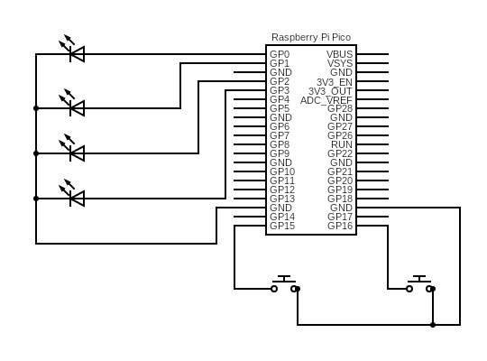

# Pico 2 Async State
This project contains a small program written for the Raspberry Pi Pico 2 mcu. It is heavily based on [The Zero To Async project](https://github.com/therustybits/zero-to-async), but ported to the Raspberry Pi Pico.

## Functionality
The program when initialized will send a signal across one of four pins, which will cause an led to blink. When a button is pressed, the program adjusts which led is currently blinking, based on the orientation of the button.

## Circuitry

The circuit consists of four leds, connected to GPIO pins 0-3 on the Raspberry Pi Pico. Additionally two momentary switches (push buttons) are connected to pins 15 and 16. The signal from these pins is read by the Pico.

## Logic
On startup, the pico will initiate the pico HAL, requisition and assign the respective pins for the LEDS, and spawn two Embassy tasks, which wait for input on the buttons. The button tasks will provide a notification to the the main process via a channel, which indicates which button has been pressed. This then updates the 'Light Cursor' object, which will update the currently active pin, and store this state.

The main process will then drive the currently active led on or off in a loop, before checking for updates from the button channel.

### Project Goals
My aim with this small project was to get a small, but interactable project bootstrapped on the Pico, without direct use of the provided SDK. In addition i wanted to explore embedded async with the embassy library.

### Resources I Found Helpful
https://github.com/therustybits/zero-to-async -> An excellent introduction to embedded rust in a mostly architecture agnostic way.
https://pico.implrust.com/ -> An excellent introduction to embedded rust on the raspberry pi pico 2 in specific.